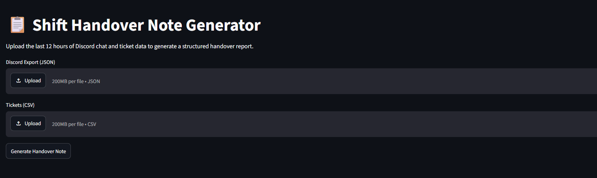
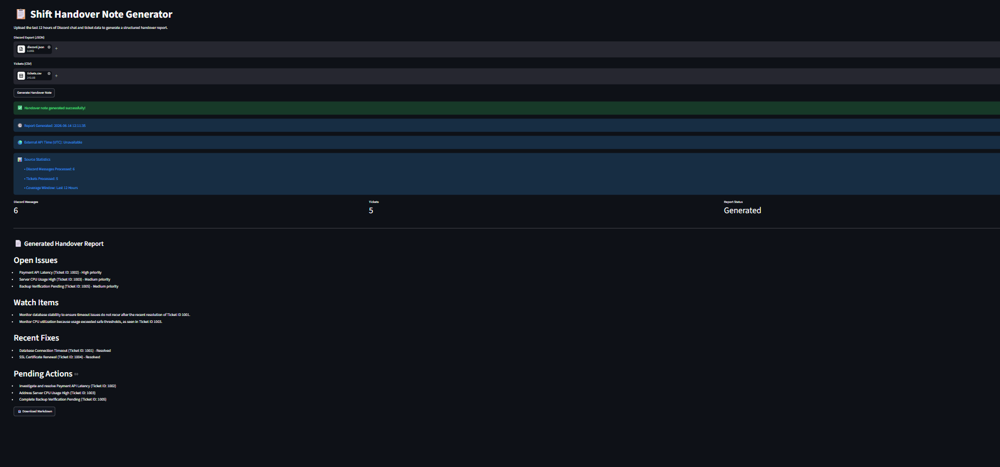

# Shift Handover Note Generator

## Overview

Shift Handover Note Generator is an AI-powered application that automatically generates structured support-engineering handover reports from Discord chat exports and ticketing system data.

The application processes the last 12 hours of operational activity, merges duplicate incidents across sources, and produces a concise markdown report for the next support shift.

---

## Features

* Upload Discord chat exports (JSON)
* Upload ticket data (CSV)
* AI-generated handover reports
* Incident deduplication across sources
* Structured markdown output
* Download report as Markdown
* Input validation and error handling
* Source statistics dashboard
* Report generation timestamp
* External API integration
* Automatic output validation and retry mechanism

---
## Screenshots

### Upload Interface


### Generated Report



## Technology Stack

* Python
* Streamlit
* Pandas
* Groq API
* Llama 3.3 70B Versatile
* Requests

---

## Project Structure

```text


SHIFT-HANDOVER-SYSTEM/
│
├── data/
│   ├── discord.json
│   └── tickets.csv
│
├── outputs/
│   └── sample_output.md
│
├── screenshots/
│   ├── generated_output.png
│   └── uploadimage.png
│
├── src/
│   ├── __init__.py
│   ├── external_data.py
│   ├── llm_helper.py
│   ├── processor.py
│   └── utils.py
│
├── tests/
│   ├── __init__.py
│   ├── test_basic.py
│   └── TESTCASES.md
│
├── team_members_resumes/
│   └── (resume files)
│
├── .env                
├── .gitignore
├── ai_usage_note.md
├── app.py
├── prompts.md
├── README.md
└── requirements.txt

 ## Installation

Install dependencies:

```bash
pip install streamlit pandas groq python-dotenv requests
```

---

## Configuration

Create a `.env` file:

```env
GROQ_API_KEY=your_api_key_here
```

---

## Run Application

```bash
python -m streamlit run app.py
```

---

## Input Formats

### Discord JSON

```json
[
  {
    "timestamp": "2026-06-13 08:00",
    "author": "Rahul",
    "message": "Database connection timeout observed."
  }
]
```

### Tickets CSV

```csv
TicketID,Issue,Status
1001,Database timeout,Resolved
1002,Payment API latency,Open
```

---

## Output Sections

* Open Issues
* Watch Items
* Recent Fixes
* Pending Actions

---

## Error Handling

The application validates:

* JSON format
* CSV format
* Required fields
* Empty files
* Missing columns
* Missing report sections

---

## Future Improvements

* S3 integration
* Slack integration
* Multi-team support
* PDF export
* Dashboard analytics
* Historical trend analysis
